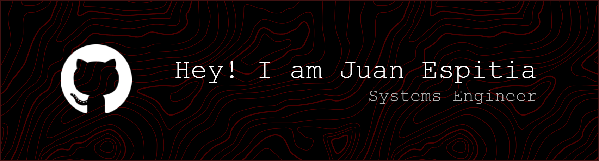

    

I'm Juan Manuel, a programmer who loves learning new things and getting involved in new projects, but most of all, I love building new things with my own hands.

<h2 align="left">🚀 Skills</h2>
   

<h3 align="left">Connect with me:</h3>

    
    

